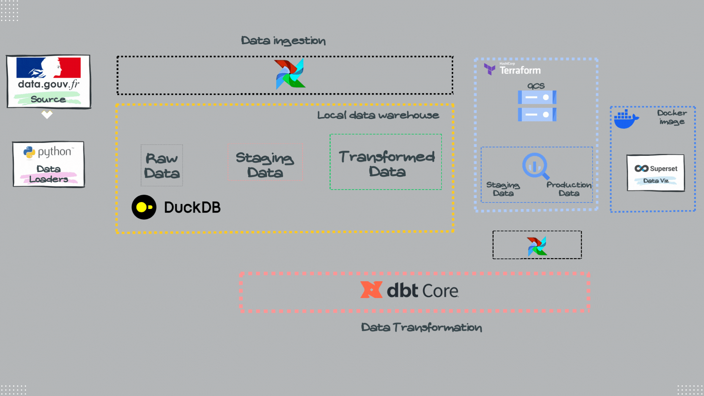

# DE Zoomcamp - Capstone project: A study on car accidents in France between 2019 and 2022

This repository contains the implementation of my capstone project, from participating in the Data engineering zoomcamp, 2024 cohort. The project is about analyzing the progression of car accidents in France, from 2019 to 2022, with a focus on the evolution of the number of deceased people. 

The data will be fetched from a web open data platform, processed with and loadded into **DuckDB** as a local datawarehouse (for staging and dev area for data transformation), transformed using **dbt-core** and pushed into **BigQuery** as a production data warehouse, and then visualised using **Apache Superset** (runing in a docker container). 

We will use **Apache Airflow** as an orchestrator for the dbt-core production build, and also to orchestrate the batch data processing. **Terraform** will be used to set up the cloud environment (we will be working on GCP), and **Docker** will enable us to contenairise our code so that it could run anywhere (easing the reproductibility). 

## About the project
The project is divided in five main parts: 
1. [data extraction](https://github.com/drux31/capstone-dezoomcamp/tree/main/data_extraction) ;
2. [data ingestion](https://github.com/drux31/capstone-dezoomcamp/tree/main/data_ingestion);
3. [data transformation](https://github.com/drux31/capstone-dezoomcamp/tree/main/data_transformation) ;
4. [data visualisation](https://github.com/drux31/capstone-dezoomcamp/tree/main/data_visualisation)
5. [reproductibility](https://github.com/drux31/capstone-dezoomcamp/tree/main/reproductibility)

## General architecture

## Detailed stack
* Cloud:
    * platform: GCP (**BigQuery** and **Cloud storage**);
    * IaC tool: **Terraform**.
* Data ingestion (chosse either batch or stream):
    * processing: **Batch**;
    * workflow orchestration: **airflow**.
* Data warehouse:
    * local: **duckDB**;
    * cloud: **BigQuery**;
    * patitionning and clustering: no partition since the dataset is small.
* Transformation:
    * technology used: **dbt-core**;
    * scheduling: **airflow**.
* Dashboard:
    * Technology: **Superset**;
    * number of tiles: **6**
* Reproductibility:
    * instructions are detailled [here](https://github.com/drux31/capstone-dezoomcamp/tree/main/reproductibility).