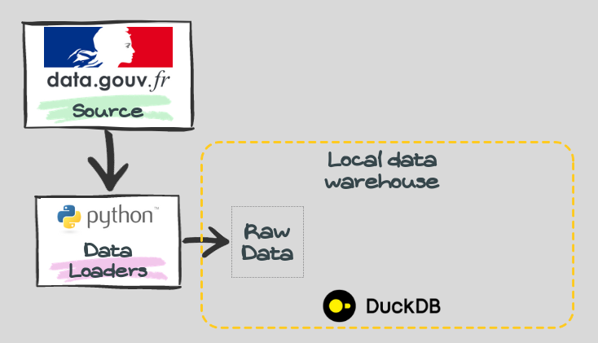

# DE Zoomcamp - Capstone project: A study on car accidents in France between 2019 and 2022

This repository contains the implementation of my capstone project, from participating in the Data engineering zoomcamp, 2024 cohort. The project is about analyzing the progression of car accidents in France, from 2019 to 2022, with a focus on the evolution of the deceased people. 

The data will be fetched from a web open data platform, processed with and loadded into **DuckDB** as a local datawarehouse (for staging and dev area for data transformation), transformed using **dbt-core** and pushed into **BigQuery** as a production data warehouse, and then visualised using **Apache Superset**. 

We will use **Apache Airflow** as an orchestrator for the dbt-core production build, and also to orchestrate the batch data processing. **Terraform** will be used to set up the cloud environment (we're will be working on GCP), and **Docker** will enable us to contenairise our code so that it could run anywhere (easing the reproductibility). 

## About the project
The project is divided in four main parts: 
1. data extraction ;
2. data ingestion ;
3. data transformation ;
4. data visualisation.

### Data extraction
The dataset we are working with is extracted from the French government open data platform, with a focus on the data produced between 2019 and 2022. Since we are working with structured data only, there is no need to set up a data lake for object storage. Then the data will be extracted using a python script and stored localy in DuckDB, used as a local datawarehouse.

**Tools used for this process** : 

&rarr; simple python script for downloading the data ;

&rarr; DuckDB as local datawarehouse where we are storing the dowloaded data (we will create a schema called raw that will contain the conrresponding data).

The extraction script will be executed only once.

Architecture :

### Data ingestion
