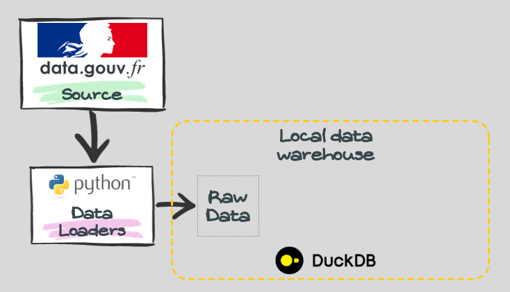

## Data extraction

The dataset we are working with is extracted from the French government open data platform, with a focus on the data produced between 2019 and 2022. Since we are working with structured data only, there is no need to set up a data lake for object storage. Then the data will be extracted using a python script and stored localy in DuckDB, used as a local datawarehouse.

**Tools used for this process** : 

&rarr; simple python script for downloading the data ;

&rarr; DuckDB as local datawarehouse where we are storing the dowloaded data (we will create a schema called raw_data that will contain the conrresponding data). 

The extraction script will be executed only once.