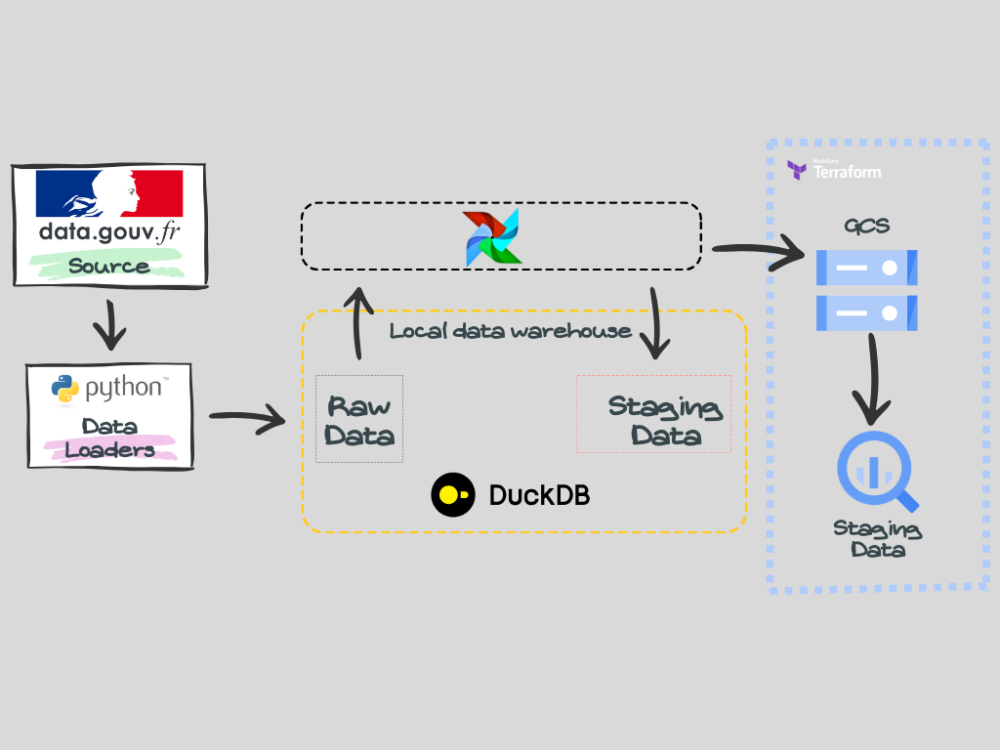

## Data ingestion

The objective of this part is move the data extracted from the previous step, into the staging area and prepare them for the transformation process.
We will use **Apache airflow** to create two dags corresponding to two pipelines:
* a first pipeline that will load a  batch of data between 2019 and 2021;
* and another pipeline that will load the data from 2022 daily ; we are doing this since the dataset is updated once a year, so we are manually simulating a daily update from the 2022 data into the data warehouse.

We also need to create a staging area into BigQuery, so when we will run dbt into production, there won't be a problem with the availability of the data.
