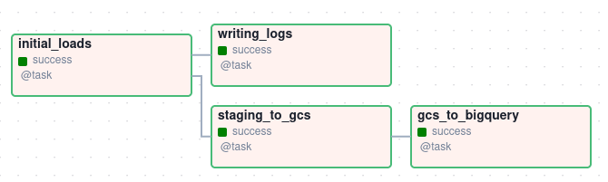
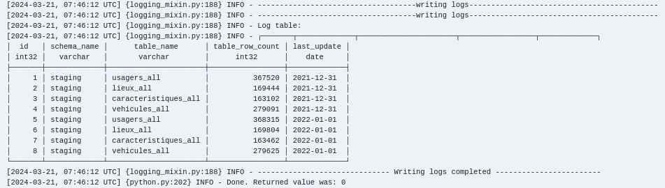
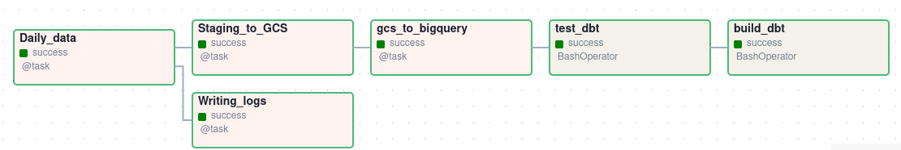

## Data ingestion


In this part, we will use Airflow to use the data in two pipelines to the staging area:
* a first pipeline that will load a  batch of data between 2019 and 2021 ;
* and another pipeline that will load the data from 2022 daily ; we are doing this since the dataset is updated once a year, so we are manually simulating a daily update from the 2022 data into the data warehouse.

We will need to install airflow to be able to complete the ingestion process.

1.  Installing Airflow

Following the [documentation](https://airflow.apache.org/docs/apache-airflow/stable/start.html), we will install airflow using pip. Our configuration is the following:
* setting airflow home : ```export AIRFLOW_HOME=~/de_project/capstone-dezoomcap/airflow```

* install airflow:
```
AIRFLOW_VERSION=2.8.3

# Extract the version of Python you have installed. If you're currently using a Python version that is not supported by Airflow, you may want to set this manually.
# See above for supported versions.
PYTHON_VERSION="$(python --version | cut -d " " -f 2 | cut -d "." -f 1-2)"

CONSTRAINT_URL="https://raw.githubusercontent.com/apache/airflow/constraints-${AIRFLOW_VERSION}/constraints-${PYTHON_VERSION}.txt"
# For example this would install 2.8.3 with python 3.8: https://raw.githubusercontent.com/apache/airflow/constraints-2.8.3/constraints-3.8.txt

pip install "apache-airflow==${AIRFLOW_VERSION}" --constraint "${CONSTRAINT_URL}"
```

Once airflow is installed, we need first to do two things : 
* create dags and plugins folder into airflow home folder (use ```mkdir```) ;
* change the file ``` airflow.cfg ``` by setting ``` load_examples ``` to false (line 106) and making the dags folder is correctly configured ``` dags_folder = path_to_airflow_home/dags ``` (line 7). The path needs to be absolute (It looks like this in my case ``` dags_folder = ~/de_project/capstone-dezoomcap/airflow/dags ```).

Another point to note is that we will need to add the variable AIRFLOW_HOME to our .profile file, so we don't have to set it manually everytime you launch airflow.

Once airflow is installed and configured, we can now launch it :
``` airflow standalone ```
This command will migrate the database, create a user with admin privileges and launch the scheduler.

2. Running DAGs
In order to run our pipelines, we will create two separate DAGs:
* one that will run only once, and will load all the data from 2019 to 2021, from the raw_data schema to the staging schema ;
* one that will run daily to ingest daily data from 2022.

The scripts can be found in the folder: ``` airflow/dags/ ```.

In order to make sure everything run well, we created a table called ``` dw_log_table ``` in the schema staging. This table actually stores the row counts of all the table within the staging area, after every DAG run, storing the date of of the latest run (in order to simulate or daily import, we started with the first latest date as 31/12/2021, so the daily import will start on 2022/01/01).

If everything went fine, we will get the following in the logs of each tasks:
 
* task batch data - after the load:




* daily data - example of the log after the first daily load:






#### Troubleshooting
kill -9 `ps -aux | grep airflow | awk '{print $2}'`
kill -9 `ps aux | grep airflow | awk '{print $2}'`
kill -9 `ps -aux | grep airflow | awk '{print $2}'`
