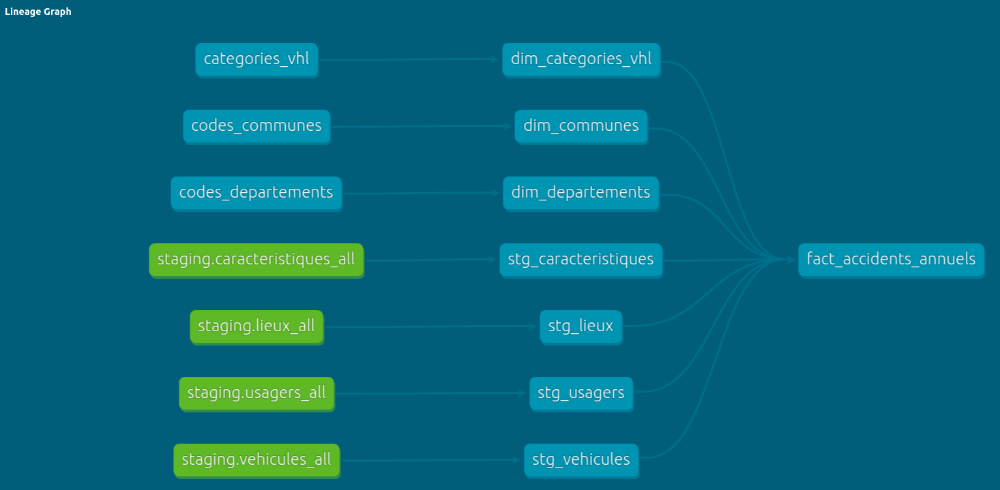

## Data transformation


For this part, we will be working with dbt core. The transformation is divided in three parts : 
1. creating the models for the staging area ;
2. creating the core models for the dev builds ;
3. building the models for production (into BigQuery).

Being concrete, we will mainly have to do following :
* install dbt-cloud (using pip - ``` python -m pip install dbt-core ```) ; 
* install dbt-ducdb package, to be able work with duckdb (``` python -m pip install dbt-duckdb ```);
* install dbt-bigquery to be able to work with BigQuery (``` python -m pip install dbt-bigquery ```);
* build the model for production ;
* schedule the building with airflow, since we're working locally with dbt-core.

### Creating the models for the staging area



#### Staging models
Our staging area includes the following models : 
* ```stg_caracteritiques```: which transforms the data about the characteristics of all the accidents (identified uniquely) ;
* ```stg_lieux```: which transforms the data about the location of the accidents ;
* ```stg_usagers```: which transforms the data about the people involved in every accidents ;
* ```stg_vehicules```: which transforms the data about the vehicules involved in every accidents.

we also included some test in the models, so that everytime we run, we make sure that nothing is broken.

#### Seeds
Seeds are CSV files that are loaded directly into the data warehouse, to serve as a dimension for the final model. We did add three seeds in our models.

#### Macros
Macros are Jinja pieces of code that can be reused multiple times. We defined some macros in our project, that we use to avoid repeating some portion of codes several times.

#### Core models

The core models are composed by a fact and several dimensions. Those models are built into the dev environement at first, and then ran into the production data warehouse.


