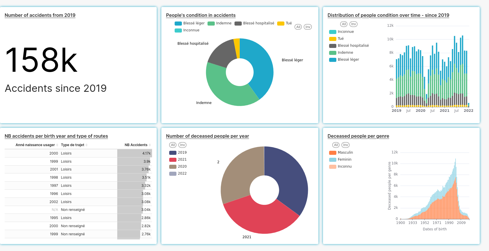

## Visualisation

This part is about creating a dashboard from the data ingested with dbt.

We use superset for our dashboard.

### Analysis :
According to the dashboard, we can easily assume the followings :
* Younger people have more accidents (those born in 2000 are the one with most of the accidents) ;
* Men cause more accidents than women ;
* The majority of the accidents happens in leisure time ;
* on average, 3000 people died each year between 2019 and 2021.