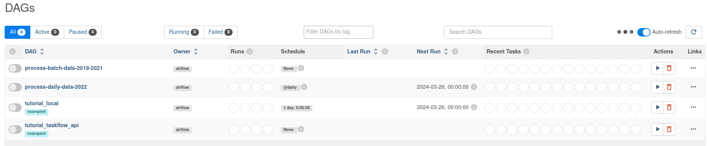

## Reproductibility

Before you begin, make sure you meet the following prerequisite:
* you have docker installed ;
* you have a python version of at least 3.9 ;
* you run on linux or on a virtual machine hosting linux.

This can performed on windows but some adaptations might be required on your part.

### Running the project: 

1. clone the git repo:
```
git clone git@github.com:drux31/capstone-dezoomcamp.git capstone-drux
```
2. enter the repo and create a virtual env:
```
cd capstone-drux
```
```
virtualenv -p python3 .venv_capstone_drux 
```
```
source .venv_capstone_drux/bin/activate
```

3. Install the requirements.txt with pip
```
pip install --upgrade -r requirements.txt
```

4. install airflow with pip (following the official [documentation](https://airflow.apache.org/docs/apache-airflow/stable/start.html))

* set airflow home : ```export AIRFLOW_HOME=Path_to_the_airflow_folder_in_the_repo```

* install airflow:
    * set airflow version : ```AIRFLOW_VERSION=2.8.3```
    * Extract the version of Python you have installed. If you're currently using a Python version that is not supported by Airflow, you may want to set this manually (See official doc for supported versions) : ```PYTHON_VERSION="$(python --version | cut -d " " -f 2 | cut -d "." -f 1-2)"```
    * Define the constraint URL: ```CONSTRAINT_URL="https://raw.githubusercontent.com/apache/airflow/constraints-${AIRFLOW_VERSION}/constraints-${PYTHON_VERSION}.txt" #For example this would install 2.8.3 with python 3.8: https://raw.githubusercontent.com/apache/airflow/constraints-2.8.3/constraints-3.8.txt```
    * install airflow: ```pip install "apache-airflow==${AIRFLOW_VERSION}" --constraint "${CONSTRAINT_URL}"```

3. set all the env variables (add the corresponging values, then copy and past in the terminal):
```
export DBT_PROJECT_DIR=change_this_to_path_to_data_transformation_forlder_in_the_repo;\
export DBT_PROFILES_DIR=change_this_to_path_to_data_transformation_forlder_in_the_repo;\
export GOOGLE_CREDENTIALS=change_this_to_path_to_the_google_json_credential_file;\
export DATA_FOLDER=change_this_to_path_to_data_folder_in_the_repo;\
export DATA_PROJECT=change_this_to_path_to_the_repo;\
export GOOGLE_APPLICATION_CREDENTIALS=change_this_to_path_to_the_google_json_credential_file;\
export DBT_PROJECT_FOLDER=change_this_to_path_to_data_transformation_forlder_in_the_repo;\
export AIRFLOW_HOME=path_to_airflow_folder
```

4. Create the google resources
    * enter the folder ``` production_setup ```: ```cd production_setup ```
    * create the resources with terrafor:
        * ``` terraform init ```
        * ``` terraform plan ``` to see the resources that will be created
        * ``` terraform apply ```.

5. run the following command:
    * ``` cd data_extraction;./data_extraction.py ```
    * this will download the raw data from the internet and store it into a local duckdb datawarehouse (you should now have a file called project_dw.db in the data folder).

6. Open another terminal window:
    * go into the project folder and activate the virtual env (step 2), paste the env variable in the terminal (step 3);
    * change the file ``` airflow/airflow.cfg ``` by setting ``` load_examples ``` to False (line 106) and making sure the dags folder is correctly configured ``` dags_folder = path_to_airflow_home/dags ``` (line 7);
    * then launch airflow: ``` airflow standalone ```
copy the password created (shown in the terminal) and go to ``` http://localhost:8080/login ``` (user: admin; pass: the password you copied)
Your dashboard should look like this:



7. trigger the first DAG (process-batch-data-2019-2021) to extract the data and create the staging area in your data warehouse, created in stage 5.
If your DAG ran correctly, the result should look like this:


In your log, you should have the following:

```
[2024-03-27, 20:52:07 UTC] {logging_mixin.py:188} INFO - 
┌───────┬─────────────┬──────────────────────┬─────────────────┬─────────────┐
│  id   │ schema_name │      table_name      │ table_row_count │ last_update │
│ int32 │   varchar   │       varchar        │      int32      │    date     │
├───────┼─────────────┼──────────────────────┼─────────────────┼─────────────┤
│     1 │ staging     │ usagers_all          │          367520 │ 2021-12-31  │
│     2 │ staging     │ lieux_all            │          163102 │ 2021-12-31  │
│     3 │ staging     │ caracteristiques_all │          163102 │ 2021-12-31  │
│     4 │ staging     │ vehicules_all        │          279091 │ 2021-12-31  │
└───────┴─────────────┴──────────────────────┴─────────────────┴─────────────┘
```

And you should also have a staging area into BigQuery with the data extracted from the local data warehouse.

8. go to the data_transformation folder and create a file called profiles.yml: ```cd data_transformation;touch profiles.yml```
9. paste the following content into the file (open it with your favorite editor):
```
data_transformation:
  outputs:
    dev:
      type: duckdb
      path: "{{ env_var('DATA_FOLDER') }}/project_dw.db"
      schema: dev
      threads: 4

    prod:
      type: bigquery
      method: service-account
      project: drux-de-zoomcamp
      dataset: dbt_dez_capstone_prod
      threads: 4 # Must be a value of 1 or greater
      keyfile: "{{ env_var('GOOGLE_CREDENTIALS') }}"
      OPTIONAL_CONFIG: VALUE

  target: prod
```
save the file.
Note: you can change the target to ```dev``` if you want to run dbt locally first.

10. Now run the following (in that order):
    * ```dbt seed```
    * ```dbt run```
    * ```dbt test```
    * ```dbt build```

11. Now you can either trigger the second DAG (process-daily-data-2022) manualy, or wait for it to run as scheduled.

12. go into the data_visulisation folder and do the following:
    * go to the folder: ```cd ../data_visualisation```
    * create a secret key: ``` openssl rand -base64 42 ```. 
    copy the generated secret key and keep it because we are going to use it later.
    * build the docker image using the Dockerfile in the folder: ```docker build -t local/superset .```
    * launch the docker image: 
    ```
    docker run -d -p 8080:8088 \
    -e "SUPERSET_SECRET_KEY=the key generated above" \
    --name superset local/superset
    ```
    * created the admin account
    ```
    docker exec -it superset superset fab create-admin \
    --username admin \
    --firstname Superset \
    --lastname Admin \
    --email admin@superset.com \
    --password admin
    ```

    * migrate local db to the latest version 
    ```
    docker exec -it superset superset db upgrade
    ```

    * load examples (this step is optional) 
    ```
    docker exec -it superset superset load_examples
    ```

    * setup roles
    ```
    docker exec -it superset superset init
    ```

    and finaly, navigate to http://localhost:8080/login/ and take a look (u/p: [admin/admin])

You can go the [official doc](https://superset.apache.org/docs/intro) to add a dataset and create some charts.

To destroy everything:
* stop airflow: ```ctrl+c``` in the terminal airflow is running;
* stop superset and delete the image: ```docker stop superset;docker image rm local/superset```;
* go into the folder production_setup and run: ```terraform destroy```
* deactivate the virtuaenv: ```deactivate```
* delete the folder: ```rm -rf capstone-drux```