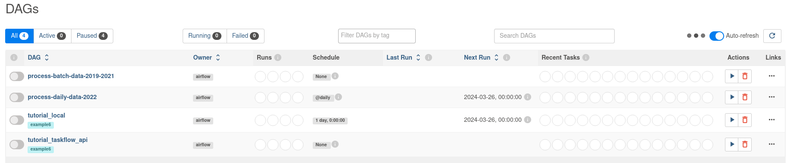

1. clone the git repo:
```
git clone git@github.com:drux31/capstone-dezoomcamp.git capstone-drux
```
2. enter the repo and create a virtual env:
```
cd capstone-drux
```
```
virtualenv -p python3 .venv_capstone_drux 
```
```
source .venv_capstone_drux/bin/activate
```

3. Install the requirements.txt with pip
```
pip install --upgrade -r requirements.txt
```

4. install airflow with pip (following the official [documentation](https://airflow.apache.org/docs/apache-airflow/stable/start.html))

* set airflow home : ```export AIRFLOW_HOME=Path_to_the_airflow_folder_in_the_repo```

* install airflow:
    * set airflow version : ```AIRFLOW_VERSION=2.8.3```
    * Extract the version of Python you have installed. If you're currently using a Python version that is not supported by Airflow, you may want to set this manually (See official doc for supported versions) : ```PYTHON_VERSION="$(python --version | cut -d " " -f 2 | cut -d "." -f 1-2)"```
    * Define the constraint URL: ```CONSTRAINT_URL="https://raw.githubusercontent.com/apache/airflow/constraints-${AIRFLOW_VERSION}/constraints-${PYTHON_VERSION}.txt" #For example this would install 2.8.3 with python 3.8: https://raw.githubusercontent.com/apache/airflow/constraints-2.8.3/constraints-3.8.txt```
    * install airflow: ```pip install "apache-airflow==${AIRFLOW_VERSION}" --constraint "${CONSTRAINT_URL}"```

3. set all the env variables:
```
export DBT_PROJECT_DIR=change_this_to_path_to_data_transformation_forlder_in_the_repo;\
export DBT_PROFILES_DIR=change_this_to_path_to_data_transformation_forlder_in_the_repo;\
export GOOGLE_CREDENTIALS=change_this_to_path_to_the_google_json_credential_file;\
export DATA_FOLDER=change_this_to_path_to_data_folder_in_the_repo;\
export DATA_PROJECT=change_this_to_path_to_the_repo;\
export GOOGLE_APPLICATION_CREDENTIALS=change_this_to_path_to_the_google_json_credential_file;\
export DBT_PROJECT_FOLDER=change_this_to_path_to_data_transformation_forlder_in_the_repo;\
export AIRFLOW_HOME=path_to_airflow_folder
```

4. Create the google resources
    * enter the folder ``` production_setup ```: ```cd production_setup ```
    * create the resources with terrafor:
        * ``` terraform init ```
        * ``` terraform plan ``` to see the resources that will be created
        * ``` terraform apply ```.
    
5. Open another terminal window:
    * go into the project folder and activate the virtual env (step 2), paste the env variable in the terminal (step 3);
    * change the file ``` airflow/airflow.cfg ``` by setting ``` load_examples ``` to False (line 106) and making sure the dags folder is correctly configured ``` dags_folder = path_to_airflow_home/dags ``` (line 7);
    * then launch airflow: ``` airflow standalone ```
copy the password created (shown in the terminal) and go to ``` http://localhost:8080/login ``` (user: admin; pass: the password you copied)
Your dashboard should look like this:



6. run the first DAG (process-batch-data-2019-2021) to extract the data and create the local data warehouse.
